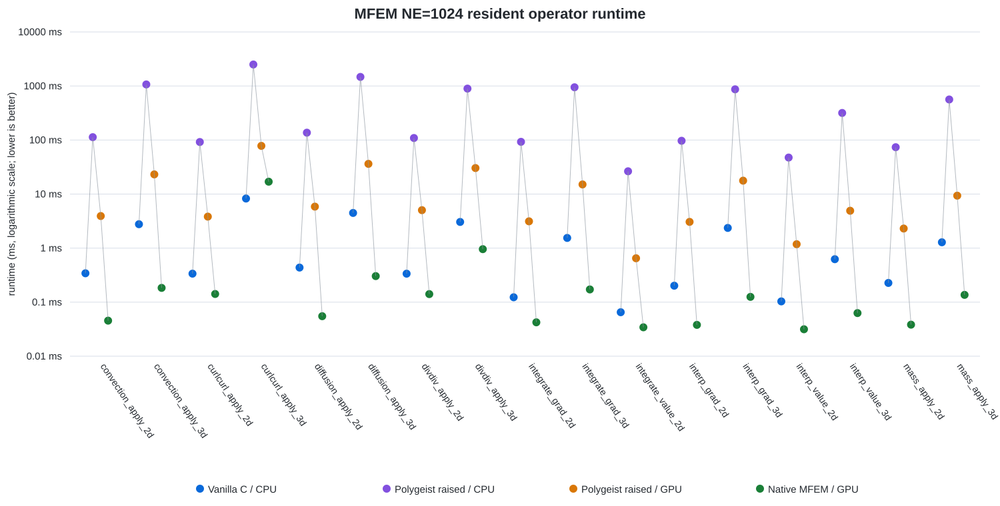
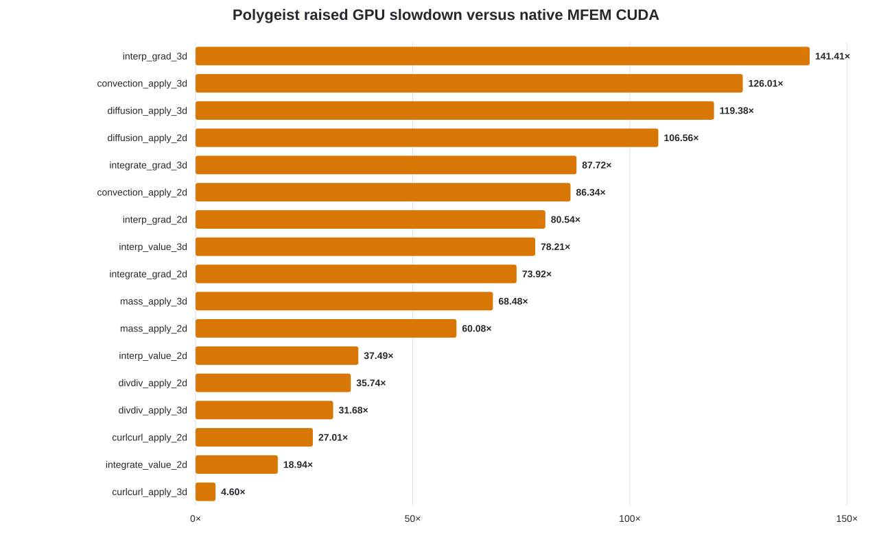

# MFEM paper analysis — NE=1024 Orin campaign

## Result

Seventeen MFEM-derived, manually normalized FP64 operator kernels have complete
four-way measurements on one Jetson AGX Orin: optimized vanilla C on the CPU,
Polygeist-raised CPU, Polygeist-raised GPU, and the corresponding upstream MFEM
CUDA kernel. The evaluated set contains 126 validated static contraction sites.

Across the 17 kernels, Polygeist raised GPU is a median **85.37x slower** than
native MFEM CUDA, with per-kernel ratios from **8.78x** to **214.40x**. Raised
GPU is a median **14.46x slower** than optimized vanilla C, and raised CPU is a
median **363.03x slower** than optimized vanilla C.

These results support a recognition-and-correctness claim, not a performance
parity claim. The main observed cost is decomposition of MFEM's fused,
element-local CUDA operators into many small pairwise cuTensorNet calls with
planning, host interaction, intermediate tensors, and additional global-memory
traffic.

## Evaluation cohort

- 17/18 normalized kernels lowered, built, executed, and passed full-output
  validation.
- 126/128 recovered static contraction sites are in those validated pipelines.
- 1,240,064 output elements were independently compared for the raised paths.
- Worst raised-path absolute error: `5.5511151231257827e-17`.
- All 17 native MFEM timing runs pass the vanilla-C complete-output checksum
  gate; the largest native checksum difference is `3.516e-13`.
- `integrate_value_3d` and its two sites are excluded. Fresh raising is already
  incorrect before matching, and the first match exposes an incompatible
  submap/memref cast.
- Mass3D network composition is disabled because the five-match composed path
  fails full-output validation. Reported raised results use the correct pairwise
  cuTensorNet path.

## Measurement protocol

- Jetson AGX Orin #2, SM87, MAXN.
- CPU 2.2016 GHz, GPU 1.3005 GHz, EMC 3.199 GHz.
- CUDA 12.6; NVIDIA driver 615.06 before and after.
- FP64, `NE=1024`, `D1D=4`, `Q1D=5`.
- Deterministic nonconstant inputs and nonzero initial output buffers.
- One executable at a time; no parallel benchmark execution.
- Five independent processes per implementation.
- Five untimed warmups followed by twenty retained samples per process.
- GPU timing ends after `cudaDeviceSynchronize`.
- Headline value: median of the five process medians.
- Total retained samples: 6,800.

## Figures

**Figure 1:** Resident operator runtime for optimized vanilla C/CPU,
Polygeist-raised CPU, Polygeist-raised GPU, and upstream native MFEM/GPU. The
y-axis is logarithmic because the measurements span more than five orders of
magnitude. Each point is the median of five independent process medians; each
process retains twenty samples after five warmups. Lower is better.

**Figure 2:** Slowdown of the Polygeist pairwise cuTensorNet GPU path relative
to the corresponding upstream native MFEM CUDA kernel. Lower is better. The
median slowdown is 85.37x.

## Claim boundary

The sources are MFEM-derived extracted and manually normalized operator
kernels, not untouched full MFEM applications. The normalized and raised paths
have independent elementwise validation. Native MFEM currently has a
complete-output checksum comparison but not a separate elementwise-output
ledger. The campaign also used dirty-tree base commit
`5464d8898667dbb9278f461336cc7ecec28f94ef`; it must be reproduced from a clean
committed revision before the numbers are treated as final publication
evidence.

## Reproducibility

- MFEM source revision:
  `951cf8886b9c0c33fb36a2f0ede268c8d6a0d8b5`
- Main ledger: `performance_20260908.csv`
- Detailed comparison: `comparison_with_native_20260908.csv`
- Native distributions: `native_summary_20260908.csv`
- Native correctness audit: `native_checksum_audit_20260908.csv`
- Full raised-path validation:
  `../FULL_OUTPUT_VALIDATION_2026-09-08.md`
- Complete campaign report:
  `../silicon_results/2026-09-08_ne1024_pairwise_campaign.md`
- Build/run/summarization scripts:
  `../../../scripts/correctness/build_mfem_native_cuda_campaign.sh`,
  `../../../scripts/correctness/run_mfem_native_cuda_campaign.sh`, and
  `../../../scripts/correctness/summarize_mfem_native_cuda_campaign.py`.

Raw timing logs and sample ledgers are retained outside the repository under
`/home/arjaiswal/mfem-ne1024-benchmark/results/` and archived as
`/home/arjaiswal/mfem-ne1024-benchmark/mfem-ne1024-native-publication-20260908-results.tar.gz`.
